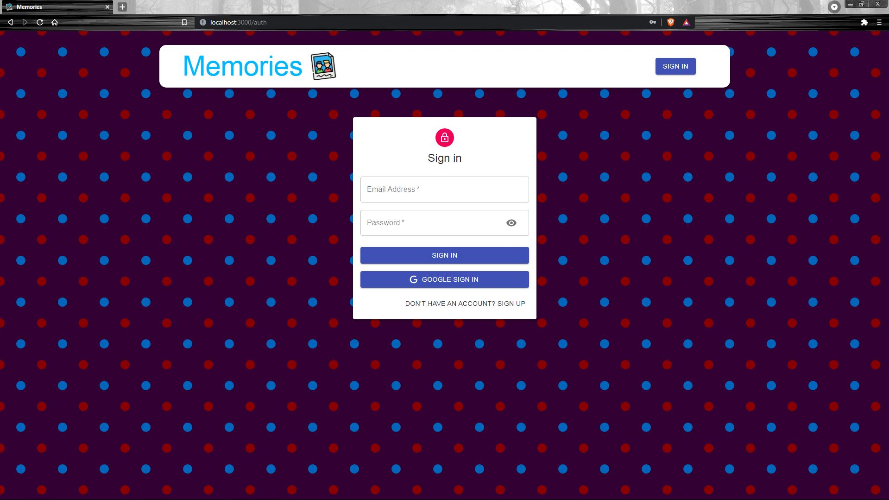
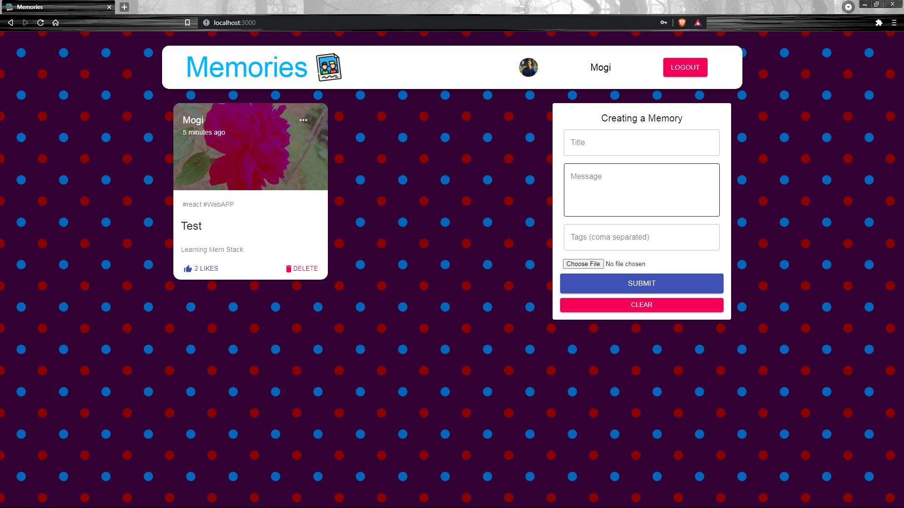

# Memories-app
Learning Mern Stack by creating a React app

The App is called "Memories" and it is a simple social media MERN application that allows users to post interesting events that happened in their lives.
Authentication is added. Auth is a complex process, it means allowing users to register and log in. Email login using JWT and OAuth Google login.

## Pictures

